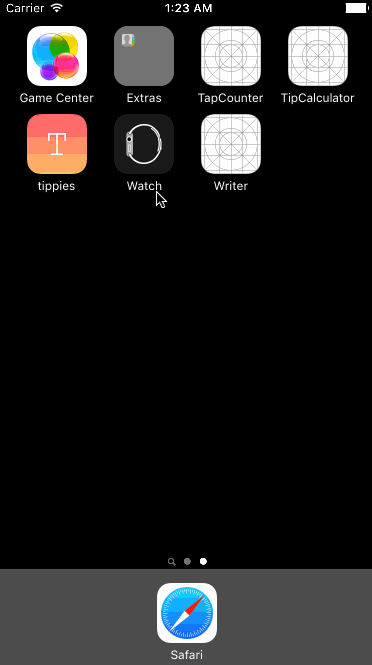

# Pre-work - **Tippies**

**Tippies** is a tip calculator application for iOS.

Submitted by: **Linne S. Huang**

Time spent: 
**8** hours spent in total =
**1.5** hours in the tutorial video + 
7 hours in searching for 1) making split with two buttons, 2) Auto-layout, 3) Changing the navigation bar color and 4) making emojis visible while it's selected

## User Stories

The following **required** functionality is complete:

* [👌] User can enter **a bill amount**, choose **a tip percentage**, and see **the tip and total values**.

The following **optional** features are implemented:

* [👌] Custom font
* [👌] UI animations
* [👌] Making sure the keyboard is always **visible** and the bill amount is always the first responder. This way the user doesn't have to tap anywhere to use this app. Just launch the app and start typing.

The following **additional** features are implemented:

- [👌] List anything else that you can get done to improve the app functionality!

  - You can split the bill
  - Using emojis as tip selectors

## Video Walkthrough 

Here's a walkthrough of implemented user stories:



GIF created with [LiceCap](http://www.cockos.com/licecap/).

## Notes

Describe any challenges encountered while building the app.

- Trying to change the navigation bar text color: 

  ```swift
navigationController?.navigationBar.tintColor = UIColor.blueColor()
  ```


- ​Trying to build the spliting function with two buttons like this:

  ```swift
    @IBAction func plusButton(sender: UIButton) {
        count += 1
        splitLabel.text = String(count)
        let split = Double(splitLabel.text!)
        print(split)
    }

    @IBAction func minusButton(sender: UIButton) {
        count -= 1
        splitLabel.text = String(count)
        print("-")
  ```


## License

    Copyright 2016 Linne S. Huang

    Licensed under the Apache License, Version 2.0 (the "License");
    you may not use this file except in compliance with the License.
    You may obtain a copy of the License at
    
        http://www.apache.org/licenses/LICENSE-2.0
    
    Unless required by applicable law or agreed to in writing, software
    distributed under the License is distributed on an "AS IS" BASIS,
    WITHOUT WARRANTIES OR CONDITIONS OF ANY KIND, either express or implied.
    See the License for the specific language governing permissions and
    limitations under the License.
